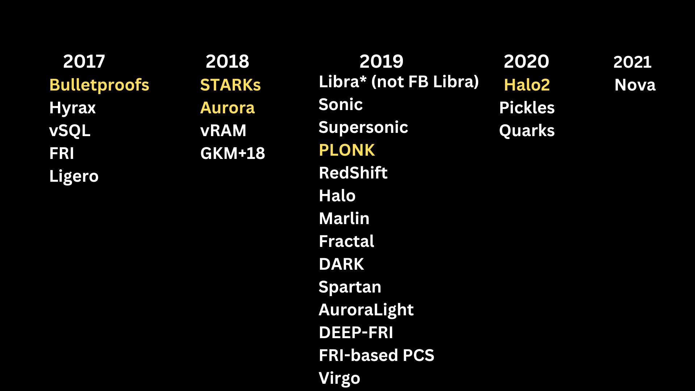

## Intro to ZKP

Imagine you have a special trick that nobody else knows how to do, but you don't want to reveal your trick to anyone. So, you come up with a game to prove that you can do the trick without actually showing how you did it.

You tell your friend to think of a number between 1 and 10, and then you secretly use your trick to figure out what the number is. You then tell your friend what the number is, and they check to make sure you're right. If you're right, then you've proven that you can do the trick without revealing how you did it.

This is like a zero knowledge proof because you're proving that you know something (the number your friend thought of) without revealing how you figured it out (your secret trick). In the same way, zero knowledge proofs can prove that someone did something (like a calculation or a puzzle) without revealing how they did it or what inputs they used.

`It's the ability to prove honest computation without revealing inputs.`

## Use cases

Zero knowledge proofs (ZKPs) can be used for privacy and scalability.

- Privacy
  - Cryptocurrencies: ZKPs can be used to enhance privacy in cryptocurrencies like Bitcoin and Ethereum. Traditional cryptocurrencies record all transactions on a public blockchain, which means that anyone can see the transaction details. However, with ZKPs, users can prove that they own a certain amount of cryptocurrency without revealing the actual amount or transaction history. This is done by using ZKPs to prove that a transaction is valid without revealing the inputs and outputs of the transaction.
  - Digital Identity: ZKPs can be used to prove identity without revealing personal information. For example, a ZKP can be used to prove that a person is over 18 years old without revealing their actual age. This is done by using a ZKP to prove that the person's age is greater than 18 without revealing the actual age.
  - Cloud Computing: ZKPs can be used to improve the privacy of data stored on cloud servers. With ZKPs, users can verify the integrity of data without actually accessing the data. This means that the cloud server can remain encrypted, which improves the privacy of the data. For example, a user can verify that a cloud server is storing their encrypted data without actually revealing the data or the encryption key.
  - Healthcare: ZKPs can be used to improve the privacy of medical data while still allowing healthcare providers to access the information they need. With ZKPs, patients can prove that they have a certain medical condition without revealing the actual condition or medical history. This can be useful for sharing medical data with multiple healthcare providers without compromising the patient's privacy.
- Scalability
  - ZKPs can be used to improve the scalability of blockchain networks. Blockchain networks require all nodes to verify each transaction, which can be computationally expensive and slow down the network. However, with ZKPs, some computations can be performed off-chain, which reduces the computational load on the network. ZKPs can also be used to compress data in a blockchain network, which reduces the size of the blockchain and makes it faster to process transactions.

## Properties of ZKP

- Completeness: A ZKP must be complete, meaning that if a statement is true, the proof of that statement should be accepted as valid. In other words, a ZKP should be able to prove that a statement is true.

- Soundness: A ZKP must be sound, meaning that if a statement is false, the proof of that statement should be rejected as invalid. In other words, a ZKP should not be able to prove that a statement is true if it is actually false.

- Zero-knowledge: A ZKP must be zero-knowledge, meaning that the proof should not reveal any information about the inputs except for the fact that the statement is true. In other words, the proof should not reveal any information that could be used to reconstruct the inputs used to create the proof.

## zk-Snarks

Imagine you have a secret message that you want to share with someone, but you don't want anyone else to be able to read it.

ZkSnarks allows you to prove that you know the message without actually revealing the message itself. It does this by creating a mathematical proof that shows that you have knowledge of the message, without actually revealing the message itself.

This mathematical proof is created using some very complex math that is designed to be very hard to break. It's like a secret code that only you and the person you're sharing the message with can understand. When you share the proof, the other person can verify that it's correct without actually seeing the message itself.

This can be very useful in situations where you need to share sensitive information but want to keep it secret from anyone else who might be listening in. It's like having a secret language that only you and your trusted friend can understand.

- We have a programmatic way to transform a statement into a language of ploynomials.
- Like with any prove system, there's a prover and a challenge.
- To make the challenge non-interactive there's a "hard coded" common reference string (CRS) or SRS (Structured Reference String) which is a part of trusted setup.
- The SRS is encrypted in order for it to be reused, which requires multiplication of encrypted values with elliptic curves, which leads to the requirement of something called elliptic curve pairings

## What is Groth16?

Groth16 is a zero-knowledge proof system that provides a way to prove the knowledge of a witness for a given statement, without revealing any information about the witness itself. It was proposed by Jens Groth in 2016, and it is based on the pairing-based cryptography.

Groth16 consists of three main components: the setup, the proof, and the verification.

    Setup: In the setup phase, a trusted authority generates public parameters that are used by both the prover and the verifier. These parameters include elliptic curve groups, a bilinear pairing function, and some random parameters.

    Proof: In the proof phase, the prover constructs a proof that demonstrates the knowledge of a witness for a given statement. The statement is usually represented as a Boolean circuit or an arithmetic circuit. The witness is a set of private inputs that satisfy the statement. The prover uses the public parameters to construct a commitment to the witness, and then performs a sequence of operations to generate a proof that can be verified by the verifier.

    Verification: In the verification phase, the verifier checks the validity of the proof using the public parameters and the statement. If the proof is valid, the verifier accepts the statement as true, without learning any information about the witness.

Groth16 has several advantages over other zero-knowledge proof systems. It is efficient and has a small proof size, which makes it suitable for use in resource-constrained environments such as mobile devices and blockchain networks.

zk-SNARKs (Groth16) have

- a (fairly) efficient prover time
- constant proof size (192 bytes)
- constant (and fast) verification time

However, Groth16 has some limitations. It requires a trusted setup, which means that the security of the system depends on the trustworthiness of the setup authority. It also requires the use of pairing-based cryptography, which can be challenging to implement correctly and securely.

## ZKPs without a trusted setup

## As an Ethereum Developer, What can I use today?

**Zokrates**
Zokrates is a project specifically designed for creating Domain-Specific Languages (DSL) for zk-SNARKs. It provides comprehensive documentation and handles many aspects of circuit construction. Zokrates allows you to write in a pseudo-language, automatically generates verifier smart contracts, and simplifies the process of deploying proofs on Ethereum. It's an excellent tool to start with due to its user-friendly features and extensive support.

**Circom & SnarkJS**
Projects like Darkforest and Tornado Cash utilize Circom and SnarkJS. These tools enable the creation of zk-SNARKs circuits and their implementation in JavaScript. Circom, along with its companion library SnarkJS, provides a JavaScript-based solution for designing circuits and generating proofs. The projects you mentioned offer helpful tutorials that can assist you in getting started with these tools.

**Zinc**
Zinc is a custom language similar to Rust, primarily developed by Matter Labs for their zk-SNARKs-based layer 2 scaling solution called zk-Sync. Zinc simplifies the process of creating circuits and generating proofs by providing a familiar syntax and powerful abstractions. If you are interested in zk-SNARKs in the context of layer 2 scaling solutions, exploring Zinc can be beneficial.

**Noir**
Noir is a Domain-Specific Language (DSL) for plonk, which is a type of zk-SNARK protocol. Plonk is known for its efficiency and scalability, making it suitable for complex computations. Noir provides a high-level language for constructing plonk circuits, allowing developers to leverage the benefits of this zk-SNARK protocol.

By familiarizing yourself with these tools and languages, you can begin building a ZKP system on Ethereum. Each option has its own strengths and areas of application, so consider your specific requirements and explore the associated documentation and tutorials to gain a deeper understanding of their usage.
