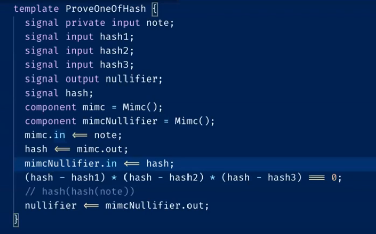
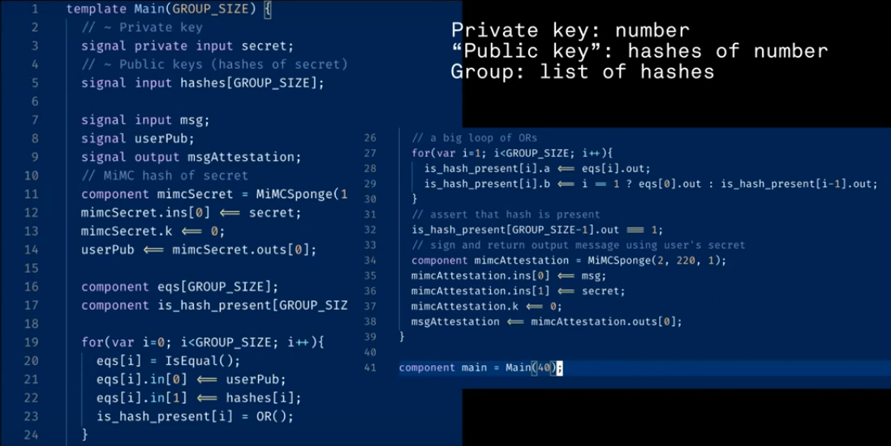

**Building DApps with ZK**

**When can SNARKs be beneficial?**

To address the issue of private state being opaque to smart contracts in Ethereum, SNARKs offer a solution. Instead of directly encrypting and storing private data on the blockchain, properties of the data can be proven using SNARKs. A commitment, such as a hash or encrypted version of the data, is then placed on the blockchain. This approach allows for the verification of non-opaque private state.

SNARKs also enable verifiable computation, which can be advantageous depending on the protocol used. By verifying SNARKs in constant time (O(1)) and shifting the computation to the prover, the expensive nature of replicated computation in Ethereum can be mitigated. Computation on personal computers is significantly faster and cheaper. This approach involves running a computationally intensive algorithm on a computer and sending the result, along with a proof of correctness, to a smart contract. Thus, computation is moved off-chain. While this property is not exclusive to NP (non-polynomial) problems, it allows for the verification of non-polynomial problems in polynomial time. The majority of SNARK development efforts in Ethereum are focused on utilizing verifiable computation for Roll-ups.

**What are the considerations and limitations?**

There are several factors to consider when working with SNARKs:

    Complexity: Implementing SNARKs can be challenging since they only support multiplication and addition, making it difficult to write circuits.

    High fixed gas cost: Verifying SNARKs carries a high fixed gas cost. Regardless of the complexity of the circuit, the verification process incurs significant expenses.

    Interoperability challenges: Contracts can call other contracts, but proving SNARK proofs within a contract would be extremely difficult and costly. To enable contract-to-contract interaction involving SNARK proofs, relayers and off-chain processes need to be employed, introducing additional complexities.

For certain tasks like generating Perlin noise, using Solidity requires less gas compared to verifying a SNARK with three public inputs. However, if multiple layers of Perlin noise are desired, the gas cost increases linearly in EVM (Ethereum Virtual Machine), while SNARK verification remains constant at O(1). This demonstrates the power of O(1) verification, as verifying additional layers in SNARKs becomes cheaper.

Perlin noise finds application in video games and procedural generation.

**Applying SNARKs to an entire blockchain**

This concept forms the basis of ZK Rollups. In ZK Rollups, the verification of an entire state machine within a blockchain is encapsulated within a SNARK. The powerful aspect is that the verifier for this SNARK can be deployed on a decentralized blockchain, allowing for the O(1) verification of correct blockchain execution. Examples of platforms utilizing ZK Rollups are ZK Sync and Starkware, which enable smart contract developers to deploy contracts on an alternate blockchain. This blockchain no longer requires expensive replication across various nodes or incentives such as proof-of-work (PoW) or proof-of-stake (PoS). Instead, a prover off-chain provides proofs of correct blockchain execution, which are then verified on Ethereum. This approach maximizes computational efficiency within a decentralized network.

**Non-Opaque Private State Applications**

    Tornado Cash: Tornado Cash is a well-known mixer application built on blockchain. It allows for private transactions by mixing them together, eliminating the link between deposits and withdrawals. Unlike previous mixers operated by centralized entities, Tornado Cash utilizes ZK proofs through the circom library, making it impossible for the mixing entity (in this case, a contract) to manipulate or retain logs.

    Dark Forest: Dark Forest is a decentralized game that enables obfuscated moves, adding an element of privacy to the gameplay experience.

    ZKML: ZKML enables the proof of performance for machine learning (ML) models without revealing the specific ML model used.

**Tornado Cash: How does it work?**

Tornado Cash functions as a mixer with the following specifications:

    Deposit funds.
    Withdraw funds to a different address.
    Prevent the linkage between the deposit and withdrawal transactions.

To initiate a deposit, a hash of a note (secret state known only to the depositor) is included in an escrow smart contract along with a specified amount of cryptocurrency. The escrow waits until it receives ten hashes, forming a certain-sized anonymity set. Once enough funds have been accumulated, the escrow halts further deposits and enables withdrawals.

To perform a withdrawal, the user needs to prove knowledge of the pre-image of one of the hashes. This proof can be achieved using SNARKs, revealing the pre-image of the hash along with the hash of the note (utilizing a different hash function called hash2).

By storing the second hash in the contract, attempts to withdraw using the same hash can be detected. If a hash has already been used to withdraw, the contract prevents subsequent withdrawals.

While the operation of Tornado Cash involves additional complexities to accommodate deposits and withdrawals at any time, the explanation provided above should suffice to illustrate the basic functionality of Tornado Cash.

Suppose an anonymity set of three exists, meaning only three possible withdrawals. Publicly, three hashes are shared since the smart contract requires their verification. These hashes are not randomly chosen but rather valid ones. Privately, the user provides their own hash, and the circuit's outcome yields a nullifier. The note is hashed, and its hash is checked against the three hashes provided during the withdrawal process (line 13). Additionally, the note is hashed again to generate a nullifier.

A relayer in blockchain is a third-party service that helps users interact with the blockchain network. Relayers can perform a variety of tasks, such as sending transactions, deploying smart contracts, and interacting with decentralized applications (dapps).

In the context of zero-knowledge proofs (ZKPs), relayers can be used to simplify the process of proving ownership of a certain asset or data without revealing any sensitive information. For example, a user may want to prove to a dapp that they have a certain amount of cryptocurrency in their wallet, but they do not want to reveal their wallet address. A relayer can help with this by generating a ZKP on behalf of the user, which the dapp can then verify without knowing the user's wallet address.

**Dark Forest**

Dark Forest is a game that is played on a hashed matrix space. On the blockchain, only the hashes of coordinates and the hashes of moves are stored. Players want to be able to prove to the game engine (in this case, a smart contract) that their move is valid without revealing it. They do this by proving the distance between two obfuscated coordinates and proving that the distance is less than a certain value.

What makes Dark Forest intriguing is that it combines privacy with a computational back door. Initially, users cannot discern the exact coordinates on the map, as they are hidden. However, users can employ brute force techniques to hash all possible coordinates, ultimately revealing the matrix space and the locations of other players. This unique aspect is facilitated by using zk-SNARKs, allowing for an affordance that would not be possible otherwise.

**ZKML**

For those familiar with the Kaggle machine learning (ML) platform used for running ML competitions, there's an intriguing possibility to establish a decentralized version of Kaggle. The concept revolves around proving the accuracy of an ML model on a public dataset without revealing its details. By maintaining the privacy of the model while showcasing its effectiveness, a decentralized market of ML models can be created on the blockchain.

Here's how it works: Someone initiates a bounty by providing a reference to a public dataset and its corresponding hash. This dataset serves as the training dataset, and anyone can train an ML model using it. Once a participant believes their model has achieved a satisfactory level of accuracy, they can publicly commit to the hash of the model (H) and provide a proof, demonstrating that the model achieves X percent accuracy on a testnet.

The entire ML model can be executed within a SNARK, where the model's parameters act as private inputs, and the dataset serves as either private or public inputs (although the distinction doesn't significantly impact the process). Essentially, the goal is to prove that the model with hash (H) attains X percent accuracy on a dataset with hash (D), as an example. By employing this approach, we can demonstrate to a smart contract that the model performs admirably with the given dataset.

**What if overfitting occurs?**

One concern that arises is the possibility of overfitting, where a model merely memorizes the training dataset. To address this, the bounty creator subsequently releases a validation set, ensuring that participants haven't fallen into the overfitting trap. In order to claim the reward, participants must evaluate the same model on the validation set, as there exists a commitment tied to the hash of their model.

To enable the bounty submitter to receive the model and claim the reward, the model is encrypted. A SNARK proof is then constructed, demonstrating that the submitter possesses a private key capable of decrypting the model using the hash (H). Running the model within the SNARK itself may not be practical, but there have been experiments where simple models, such as convolutional models, have been executed in a SNARK. It's worth noting that the time it takes to run the model within the SNARK is not a significant concern, as it only needs to be done once. It is conceivable for someone to rent a computational cluster for a few days to prove the model's effectiveness on multiple samples, but this remains an active area of research.

By following this entire process, a participant can train a model on a testset, prove its adequacy on the testset, have the bounty submitter reveal a validation set, demonstrate exceptional performance on the validation set, and finally allow the bounty submitter to decrypt the model. In exchange for completing these steps, the participant can claim the bounty. The beauty of this approach lies in its execution on a smart contract, which safeguards the interests of the model trainer. The bounty submitter is unable to act dishonestly, as their commitment to the process is enforced by the smart contract.

An additional benefit of this methodology is its potential extension to various problem domains where the goal is to create a high-performing solution. It opens doors for on-chain implementation of application-specific integrated circuits (ASICs) by incorporating a simulator into the SNARK and constructing an operational amplifier using those parameters. Now, anyone can strive to find a high-quality model, prove its effectiveness, and reveal it to the bounty submitter. This empowers people to conduct research and offer bounties on the blockchain, requiring the implementation of a verification function within the SNARK.

**ZK for identity**

Ethereum offers a permissionless identity system where anyone can generate a private key and a corresponding public key, enabling the creation of new identities. This feature is remarkable as it allows individuals to establish an identity by generating some random data. However, a challenge arises in linking these identities together, and the existing privacy model follows an all-or-nothing approach. If someone obtains your public key, they can trace your entire on-chain behavior.

Ideally, it would be beneficial to incorporate information asymmetry into this identity model. Essentially, we need a way to weakly link addresses together, similar to how attendees appear at an elite masquerade ball. At such an event, everyone wears masks, and although you know the attendees are legitimate, you are unaware of their true identities. This concept holds significance for identities on the internet and within societies, and achieving this requires the application of Zero-Knowledge Proofs (ZKPs).

**Primitive**

Ethereum utilizes the Elliptic Curve Digital Signature Algorithm (ECDSA) for its asymmetric keys. However, ECDSA is not compatible with SNARKs. Nevertheless, Circom, a programming language and toolset, introduces groth-16 circuits, which enables the construction of private applications based on Ethereum identities.

**ZK Group Messaging**

With ZKPs, it is possible to prove that a message has been signed by specific addresses without revealing which address specifically signed the message. This allows for the creation of a group chat where users are authenticated. Participants in the group chat can be certain that the message originates from someone within the group, but the exact sender remains unknown. Moreover, two additional functionalities can be achieved using this approach: claiming that a message is not yours or claiming that it is yours. These dynamics result in intriguing social interactions.

In the process of posting a message in the group chat, you have a private input, which represents your secret. While it is not a traditional private-public key pair that allows for encryption and decryption, it serves the purpose for our objective. You provide a list of hashes, which essentially function as the "public keys" of all participants in the group chat, along with the message. Using this information, you obtain an attestation. Initially, you hash your secret, and then within the for loop on line 19, you prove that the hash of your secret is part of the list of hashes. This proves your membership within the group without disclosing your specific identity. Additionally, you hash your message and secret, creating an attestation that can be used later to prove that you posted a particular message, ensuring accountability within the group chat.
