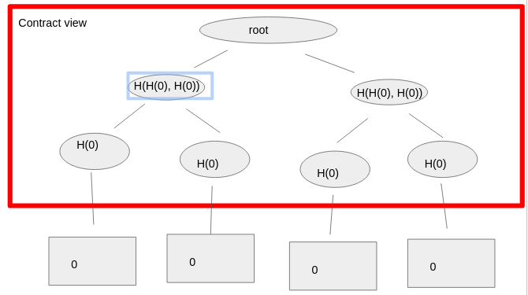
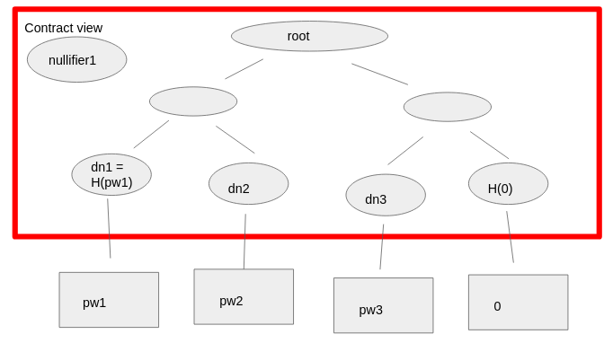
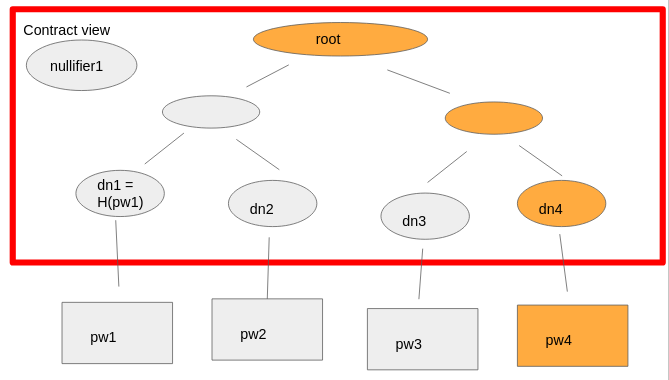
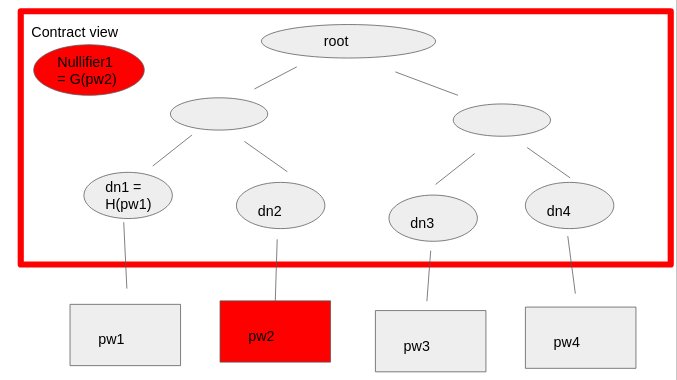
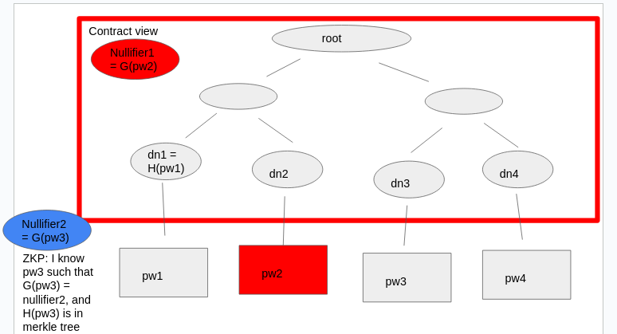
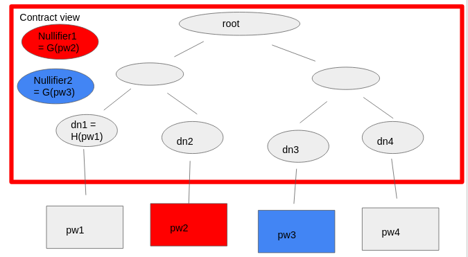

## Breaking Down Tornado Cash

To gain an understanding of the high-level functioning of Tornado Cash, please refer to [Day3](https://github.com/spo0ds/Zero-to-ZKP/blob/main/Day03/Day03.md) in my repository.

To begin, the Tornado Cash contract manages a pool of ETH and also stores deposit commitments. When the contract is instantiated, it creates a Merkle tree accumulator to store all the different deposit commitments made by users. Initially, no deposit commitments exist, so all the deposit commitment values are null. The node for the null value is represented by the hash of 0, denoted as H(0). The Merkle tree accumulator works in such a way that each parent node's value is the hash of its two children nodes. This design enables the creation of a single identifier for the entire database's state, facilitating easy verification of inclusion in the database.

In the future, Tornado Cash will support zero-knowledge proofs (ZKP) of the form "I know a secret password X such that the hash of X is present in the table of all password commitments." This proof of knowledge allows users to prove that they possess a secret value (currently 0, as shown in the picture) and, in the future, it will be X. Along with this knowledge, users also provide all the siblings and the root of the Merkle tree, allowing for efficient log(n) checks to verify that their value is indeed included in the root state of the table. This concept is known as the "Merkle Tree."

The following image illustrates the state of the contract after some users have made deposits and withdrawals.

In this image, three users have made deposits, and one user has made a withdrawal. Each deposit is associated with a password, and the contract can only see the data within the red box. Specifically, the contract has three deposit notes, each representing the hash of the respective deposit passwords. The tree is not yet fully filled, so the fourth value remains the default value, H(0), indicating that no deposit has been made in that slot yet.

Using these values, the Merkle tree accumulator is built, leading to the root that identifies the state of the table.

Now, let's explore what happens when a user wants to make another deposit. They will locally generate password four, hash it to obtain deposit note 4, and then update the tree accordingly, as shown in the image below.

This is the updated state of the contract.

Although the contract is unaware of this, the nullifier for any given withdrawal corresponds to one of the above deposits. For instance, if a user with pw2 wants to make a withdrawal, they know that nullifier 1 is the hash of pw2 but using a different hash function G. This nullifier serves as a unique identifier, preventing a second depositor from withdrawing the same password twice.

Let's walk through the process when someone else attempts to withdraw a deposit. Suppose a user with deposit note 3 (dn3) is trying to withdraw their deposit. They would present a ZKP to the contract, proving that they know password 3 such that H(3) is present in the Merkle tree. This proof establishes inclusion in the root and also asserts that G(pw3) matches the public value nullifier 2 that they declare.

The contract will then verify the ZKP, check if the declared root matches the Tornado Cash tree's root, and ensure that the nullifier value has not been previously declared in the nullifier set. If all checks pass and the nullifier is indeed new, the contract allows the user to withdraw ETH from the smart contract.

The contract remains unaware of which specific deposit note has been withdrawn, but it does recognize that a password corresponding to a deposit note in the tree has been withdrawn and that this specific password has not been withdrawn before.
